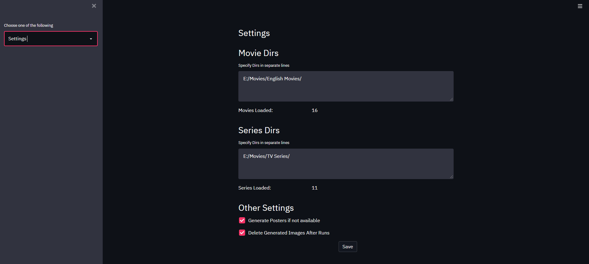
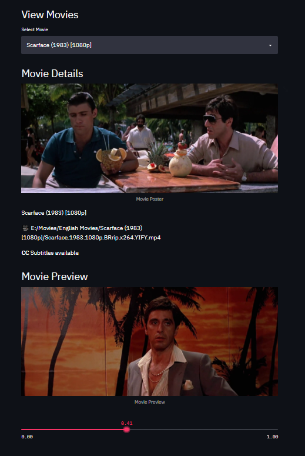
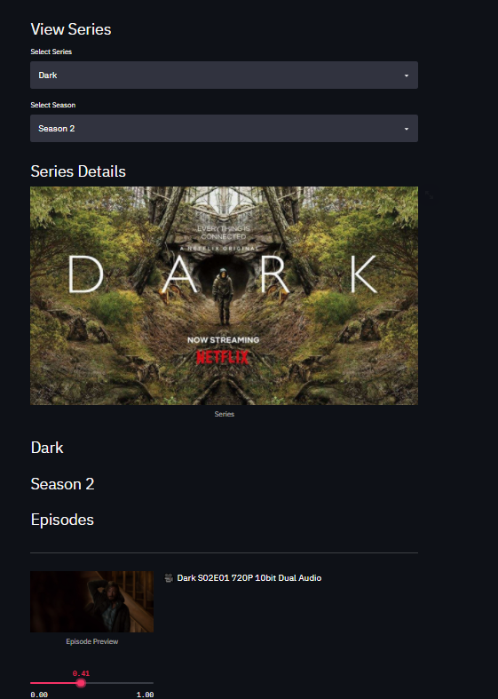

# MediaOrganiser
 Movies and Series Organised Viewing tool

# GUI
 - Install streamlit using
   ```
   pip install streamlit
   ```
 - Launch Streamlit GUI in the repo folder by
   ```
   streamlit run app.py
   ```

# Movie Organiser
 - Specify the folders to be scanned for movies under settings
    

 - Select the movie
    - View movie details and subtitles
    - View movie preview
    

# Series Organiser
 - Specify the folders to be scanned for series under settings
    

 - Select series and season
    - View series details and episodes
    - View episode previews
    
    
    